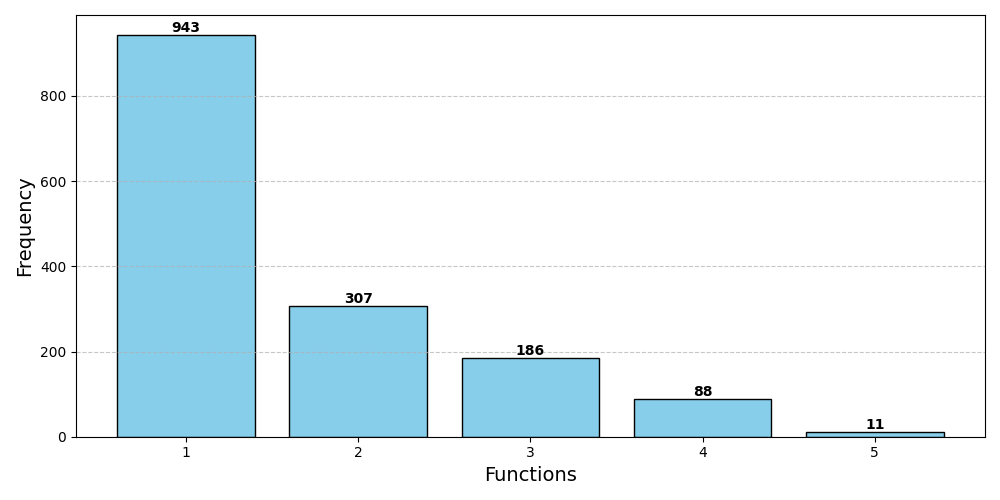
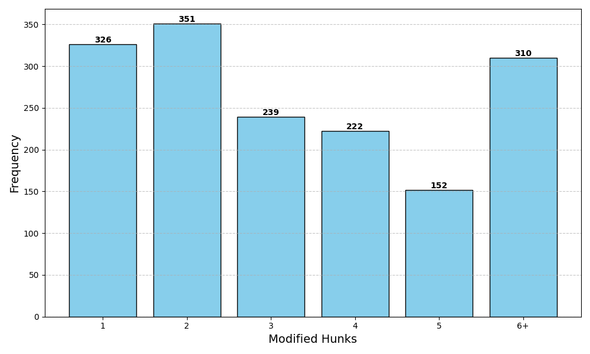
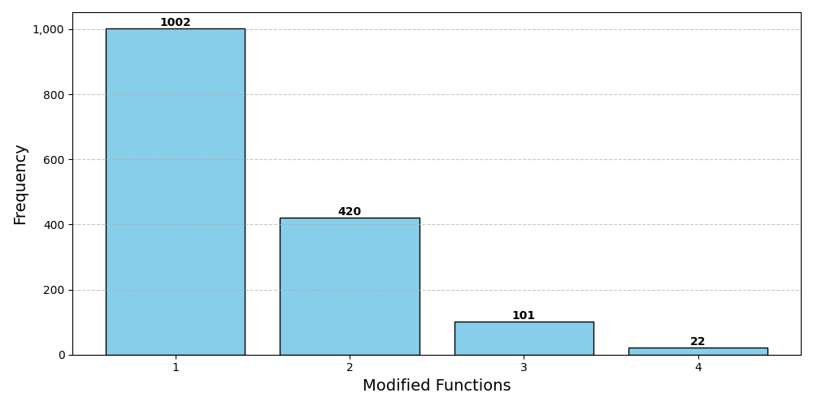

# TutorLLMCode

The TutorLLMCode dataset is a collection of real student code submissions from a company's online programming education platform. The dataset contains 1,535 buggy C++ single-file programs, varying 45 different programming problems, each with a human-written rationale for the repair written by programming tutors of a company, and each set of dataset has been manually verified. The dataset also includes the rationale auto-generated by GPT-4 for the repair of the buggy code, which are based on the buggy code and the corrected code written by origin students.

These are the distributions of the functions of buggy codes, the modified hunks between buggy and corrected codes, and the modified functions between buggy and corrected codes:








You can run this command to download all the datasets of TutorLLMCode:
```
python3 fetch_data.py
```

After that, there are 6 json files located in the directory `data/trainset/`: `llama_llm.json`, `llama_human.json`, `llama_llm_cot.json`, `starchat_llm.json`, `starchat_human.json`, and `starchat_cot.json`. The `llama` files contain the buggy code and the rationale for fine-tuning Llama-based models, including CodeLlama and Mistral, while the `starchat` files contain the buggy code and the rationale for fine-tuning StarChat-alpha. The `_llm` files contain the rationale generated by GPT-4, while the `_human` files contain the human-written rationale. The `_cot` files contain the rationale generated by GPT-4 for the repair of the buggy code, leveraged by Fine-tune-CoT fine-tuning approach.

You can see the characteristics and format of the data by looking at `data/trainset/llama_llm.json`, `data/trainset/llama_human.json` and `data/trainset/llama_cot.json`. All the json files contain a list of dictionaries, where each dictionary has the only key `text`, which is the full training sample for fine-tuning process, split by the special token EOS, and follow the instruction format of Llama-based models. In the `text` field, the text is separated by EOS into three parts: input, output of objective 1 (the repaired code), and output of objective 2 (the repaired code and corresponding rationale). The input section contains the description of the programming problem, the error code submitted by the student, and the necessary instructions.

```
{
    "text": "{INPUT}<EOS_TOKEN>{OBJECTIVE_1}<EOS_TOKEN>{OBJECTIVE_2}<EOS_TOKEN>"
}
```